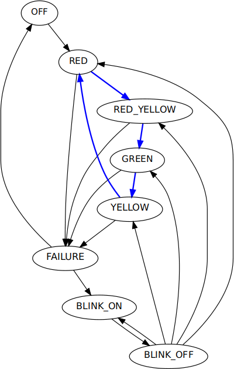

# fsmc
Finite State Machine Compiler

The Finit State Machine Compiler compile a C/C++ source code with embedded
Finite State Machines (FSMs) into C/C++ code and optionally .dot files.

## Usage

```
fsmc [<options>] [<input file>]

Options
-o|--output <file path>               output file
-d|--dot-directory <directory path>   .dot file directory
-l|--log-function <log function>      log function to call on state change
-n|--state-stack-size <n>             state stack size
-a|--asserts                          generate asserts
--dump-ast                            dump abstract syntax tree
```

Log function macros: @fromStateName@, @toStateName@

## Source code format

```
<C/C++ source>
#fsm <name>
<fsm definitions>
#end
<C/C++ source>
...
```
FSM definitions

```
[*]<state name>
{
  <statement list>
}
default
{
  <statement list>
}
...
```

The * mark the initial state. &lt;statement list&gt; are C statements to
execute in the given state.

To change to a new state use the syntax

```
-> [push|reset,]<new state name>[(<options>)];
-> [push|reset,]start[(<options>)];
-> [push|reset,]default[(<options>)];
-> pop[(<options>)];
```

```push``` save the current state on a stack and change to the new state.
```reset``` reset state stack.
```pop``` pop the last pushed state and change to that state.

Options
```
"<label>",<color>,<line width>
```

# Example traffic_lights.c

```
#include <stdlib.h>
#include <stdio.h>
#include <stdbool.h>
#include <unistd.h>
#include <assert.h>

#define TRUE  1
#define FALSE 0

#define ON  TRUE
#define OFF FALSE

bool isFailure()
{
  return FALSE;
}

bool isPower(bool enabled)
{
  return FALSE;
}

void logStateChange(const char *fromStateName, const char *toStateName)
{
  printf("DEBUG: state change '%s' -> '%s'\n", fromStateName, toStateName);
}

int main(int argc, const char *argv[])
{
  printf("FSM traffic lights demo\n");

  for (uint i = 0; i < 10; i++)
  {
    #fsm traffic_lights
      *GREEN
      {
        if (isFailure() || isPower(OFF)) -> push,FAILURE;
        printf("green: go\n");
        -> YELLOW("",blue,2);
      }

      YELLOW
      {
        if (isFailure() || isPower(OFF)) -> push,FAILURE;
        printf("yellow: prepare for stop\n");
        -> RED("",blue,2);
      }

      RED
      {
        if (isFailure() || isPower(OFF)) -> push,FAILURE;
        printf("red: stop!\n");
        -> RED_YELLOW("",blue,2);
      }

      RED_YELLOW
      {
        if (isFailure() || isPower(OFF)) -> push,FAILURE;
        printf("red-yellow: ready for start\n");
        -> GREEN("",blue,2);
      }

      FAILURE
      {
        if (isPower(OFF)) -> OFF;
        -> BLINK_ON;
      }

      BLINK_ON
      {
        -> BLINK_OFF;
      }

      BLINK_OFF
      {
        if (!isFailure()) -> pop;
        -> BLINK_ON;
      }

      OFF
      {
        if (isPower(ON)) -> reset,RED;
      }
    #end

    sleep(2);
  }

  printf("FSM traffic lights demo done\n");

  return 0;
}
```

Compile with:
```
fsmc -o build/traffic_lights.c traffic_lights.c -d --log-function 'logStateChange("@fromStateName@","@toStatename@")'
```

.dot output with Graphviz:



# Term of use and license

When you use fsmc you do this with your own responsibility and
risks.  You use fsmc as it "is".  You agree that the author of fsmc
will not be responsible for any damage on physical or virtual
entities or persons which may be caused directly or indirectly by
fsmc.  You agree not to claim for damages against the author of fsmc
in case there is an unexpected behavior or there are unexpected
results of fsmc (e.  g.  due to bugs in the software) or in case of
miss usage of the fsmc.  You can send bug reports and feature
requests - which is encouraged -, but you agree that there is no
liability of the author that a bug is corrected and you agree there
is no claim that anything is changed in fsmc by the author.

fsmc and all files are under the GPL version 2. The full GPL
version 2 license text can be found here:

  http://www.gnu.org/licenses/gpl-2.0.html

# Contact

Send an email to Torsten Rupp (author of fsmc):

torsten.rupp at gmx.net
